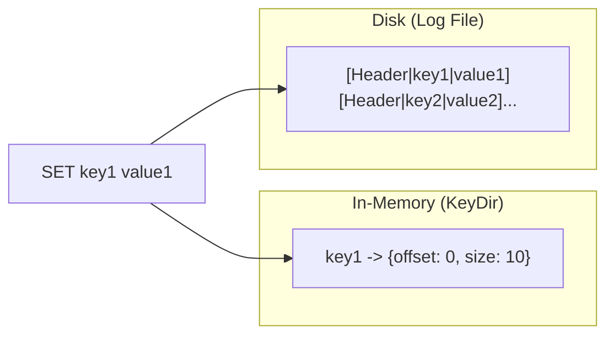
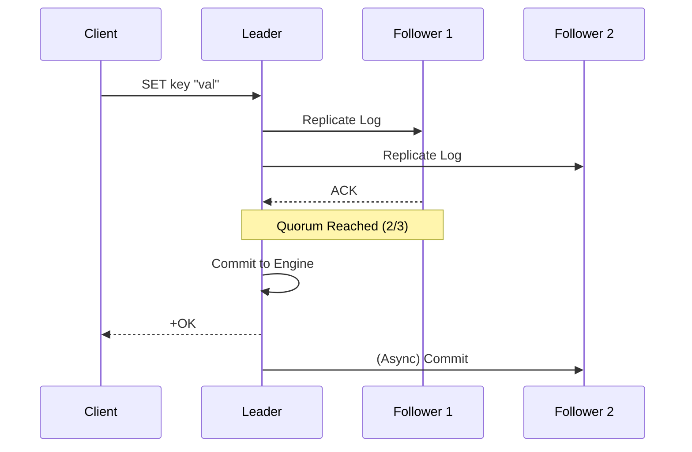
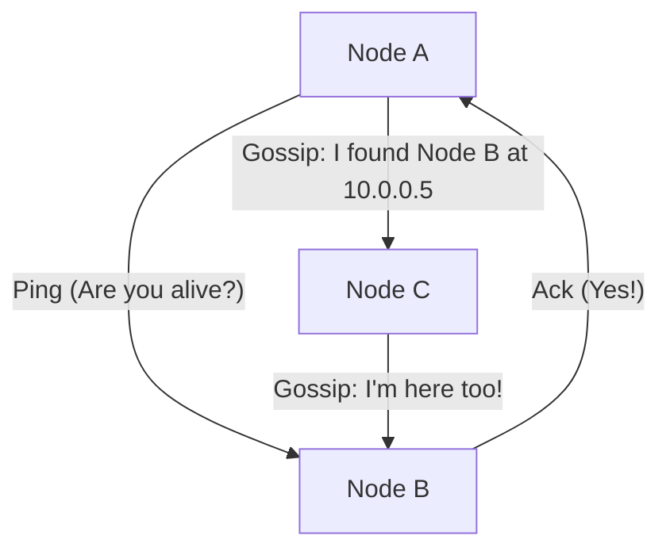
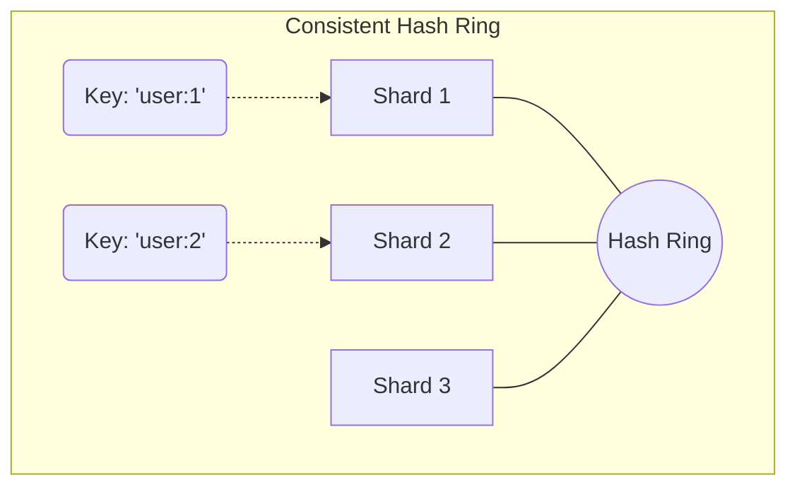

# CarrotDB Architecture: A Masterclass in Distributed Systems

CarrotDB is more than just a database; it is a **living textbook** designed to teach the fundamental trade-offs of modern distributed storage. This document explains the "Why" and "How" behind every architectural decision using visual diagrams and technical deep-dives.

---

## 1. Storage: The Bitcask Model
CarrotDB uses a **Log-Structured Merge-ish (Bitcask)** model, which transforms slow random disk I/O into fast sequential I/O.

### 📝 The Append-Only Log
Every write (`SET`) in CarrotDB is simply appended to the end of a file.



*   **Sequential vs Random:** Sequential writes are ~10-100x faster because the disk head doesn't have to "seek" all over the platter.
*   **Compaction:** Since the log is append-only, deleting a key just adds a **Tombstone**. A background process eventually merges files to reclaim space.

> **💡 Pro-Tip:** Bitcask's main limitation is that **all keys must fit in RAM**. If your keyspace exceeds memory, you need a more complex structure like an LSM-Tree (used in RocksDB).

---

## 2. Consistency: The Raft Consensus Algorithm
In a distributed system, we need a way for nodes to agree on a single "truth" even when some fail. CarrotDB uses **Raft**.

### 👑 The Consensus Cycle
A write is only considered successful when a **Quorum** (majority) of nodes agree.



*   **Strong Consistency:** Raft ensures that as long as a majority (e.g., 2 out of 3) are alive, the system is **linearizable** (it behaves like a single machine).

---

## 3. Membership: Gossip (SWIM)
How do nodes find each other without a "Master" server? They gossip.



*   **SWIM Protocol:** Nodes periodically "ping" random neighbors. If a node is slow, it's marked as **Suspect**. If it stays slow, it's marked **Dead**, and this news "gossips" through the cluster.

---

## 4. Scaling: Consistent Hashing
CarrotDB scales horizontally by splitting data into **Shards**. We use a **Hash Ring** to decide which shard owns which key.



### 🌀 Why Virtual Nodes?
If we only had 3 points on the ring, one shard might accidentally get 60% of the data. By giving each shard **40 Virtual Nodes**, we scatter them across the ring, ensuring a near-perfectly even data distribution.

---

## 5. Symmetry: The Request Flow
Every CarrotDB node is **Symmetric**. You can talk to any node, and it will act as a gateway to the entire cluster.

```mermaid
graph LR
    Client -->|GET user:1| NodeA[Node A]
    NodeA -->|Internal Hash| ShardID[Shard 2]
    NodeA -->|Forward| NodeB[Node B (Shard 2 Leader)]
    NodeB -->|Read Disk| Value[Value]
    Value --> NodeA
    NodeA -->|Response| Client
```

---

## ⚖️ The CAP Theorem
CarrotDB is a **CP System** (Consistency + Partition Tolerance).
*   During a network split, if a node can't see a majority of the cluster, it will **stop accepting writes**.
*   **Educational Insight:** Why not stay Available (AP)? Because in a database, having **two different versions of the truth** (Split Brain) is usually worse than being temporarily offline.

---
*Ready to dive deeper? Check the code in `internal/engine/`, `internal/server/`, and `pkg/sharding/` to see these concepts in action.*
